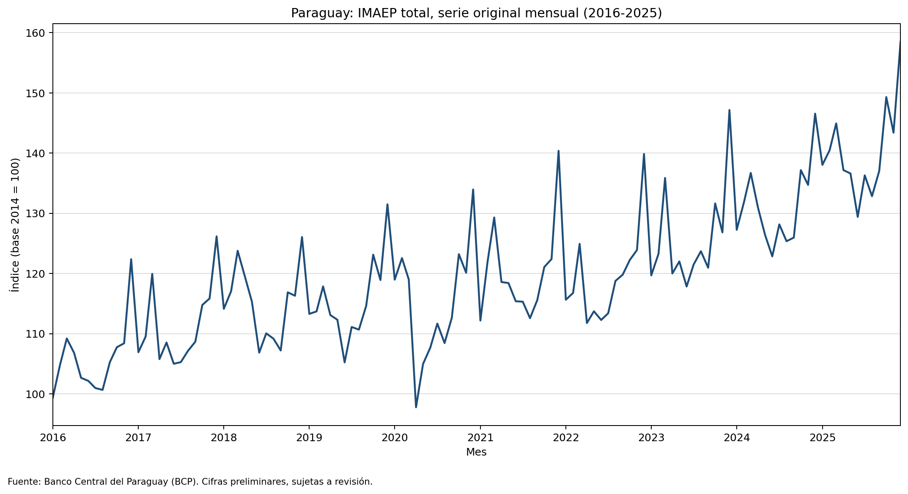
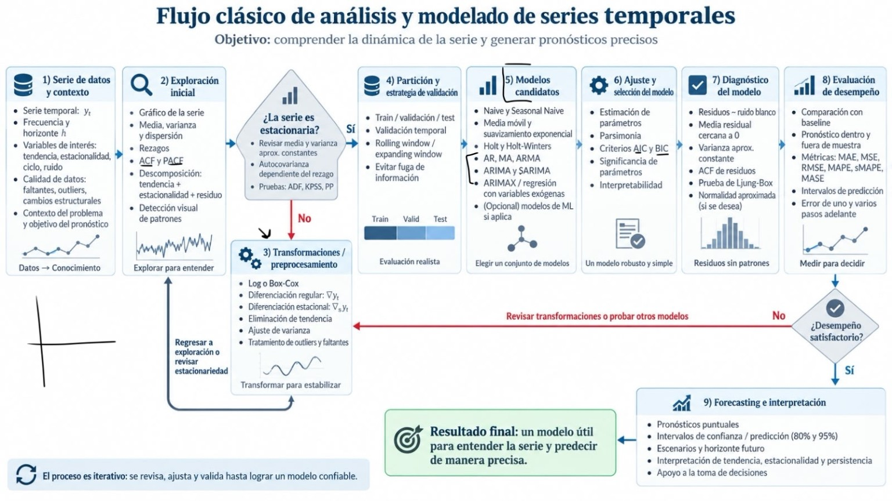

\newpage

# Resumen

Este trabajo presenta una exploración descriptiva del nivel mensual del Indicador Mensual de Actividad Económica del Paraguay (IMAEP) total, serie original, para enero de 2016 a diciembre de 2025. Se utilizaron exclusivamente datos oficiales del Banco Central del Paraguay (BCP). La entrega comprende selección trazable de la serie, controles de calidad, gráfica temporal, estadísticas básicas y una interpretación acotada a los resultados observables.

El período contiene **120 observaciones mensuales válidas**, sin fechas duplicadas ni meses faltantes. No se imputaron valores y no se implementaron modelos ni pronósticos. Todos los registros analizados están identificados en el libro como cifras preliminares, sujetas a revisión.

# Objetivo

El objetivo es describir la evolución observada del nivel del IMAEP total, serie original, entre 2016 y 2025, mediante una gráfica temporal y estadísticas descriptivas reproducibles. El trabajo no busca explicar causalmente los cambios ni evaluar estacionariedad, estacionalidad o capacidad predictiva.

# Fuente y definición del indicador

La fuente es el [Banco Central del Paraguay](https://www.bcp.gov.py/web/institucional/indicador-mensual-de-actividad-economica-del-paraguay-imaep-). El IMAEP es un índice que brinda señales de corto plazo sobre el comportamiento mensual de la producción de bienes y servicios en términos constantes. No representa el valor del PIB mensual.

- Archivo preservado: `data/raw/imaep_bcp_original.xlsx`.
- SHA-256: `7c413354fb6bbaf56b2797e33e72e33f3de91059a5a358e9e0c5dc15085c4c94`.
- Tamaño: 130756 bytes.
- Unidad confirmada: **índice base 2014 = 100**.
- Frecuencia: mensual.
- Período: 2016-01-01 a 2025-12-01.

La versión utilizada fue consultada en septiembre de 2026 y puede contener revisiones respecto de los valores publicados originalmente en cada mes.

# Selección de la serie

La inspección del libro permitió identificar la serie solicitada sin utilizar nombres supuestos:

- Hoja principal: `IMAEP`.
- Encabezado: `IMAEP!C9`, **IMAEP Serie Original**.
- Fechas y niveles: `IMAEP!B274:C393`.
- Unidad/base: `IMAEP!B8`.
- Verificación independiente dentro del libro: `IMAEP-apertura por sectores!B35:B154` y `O35:O154`, bajo los encabezados **IMAEP / Serie Original**.

No se utilizaron variaciones porcentuales, índices sectoriales, IMAEP sin agricultura ni binacionales, serie ajustada ni tendencia-ciclo. La fecha ISO usa el día 1 únicamente para identificar el mes; no implica frecuencia diaria.

# Preparación y controles de calidad

El procesamiento se realizó mediante `analizar_imaep.py`, sin copiar resultados manualmente. Los valores se conservaron con la precisión disponible en el Excel y solo se redondearon para su presentación.

| Control | Resultado |
|---|---|
| Observaciones esperadas | 120 |
| Observaciones válidas | 120 |
| Fechas duplicadas | Ninguna |
| Meses faltantes | Ninguno |
| Valores no numéricos | 0 |
| Valores no finitos | 0 |
| Orden cronológico | Correcto |
| Continuidad mensual | Correcta |
| Coincidencia con la hoja sectorial | Sí, 120 de 120 |
| Coincidencia exacta CSV-Excel | Sí, 120 de 120 |
| Cifras preliminares | 120 de 120 |

# Serie temporal

{width=95%}

La figura muestra fluctuaciones mensuales y niveles generalmente mayores hacia el final del período que al comienzo. El menor nivel observado fue **97.782** en **2020-04-01** y el mayor fue **158.480** en **2025-12-01**. Estas observaciones no identifican por sí mismas las causas de los movimientos.

# Estadísticas descriptivas

| Estadística | Valor | Unidad | Mes asociado |
|---|---|---|---|
| Cantidad válida | 120 | observaciones | - |
| Cantidad faltante | 0 | meses | - |
| Media | 119.985 | índice | - |
| Mediana | 118.846 | índice | - |
| Mínimo | 97.782 | índice | 2020-04-01 |
| Máximo | 158.480 | índice | 2025-12-01 |
| Rango | 60.698 | índice | - |
| Q1 | 111.540 | índice | - |
| Q3 | 126.239 | índice | - |
| Rango intercuartílico | 14.699 | índice | - |
| Varianza muestral | 144.822 | índice^2 | - |
| Desviación estándar muestral | 12.034 | índice | - |

La media del período fue **119.985** y la mediana **118.846**. El 50 % central de los niveles se ubicó entre **111.540** y **126.239**, con un rango intercuartílico de **14.699**. El rango total fue **60.698** puntos de índice.

La varianza y la desviación estándar son muestrales y usan denominador $n-1$. Q1 y Q3 se calcularon mediante cuantiles inclusivos con interpolación lineal y posición $(n-1)p$. Las estadísticas describen los niveles del período; no prueban estacionariedad.

# Interpretación y limitaciones

Los resultados muestran una dispersión muestral de **12.034** puntos de índice alrededor de la media y una amplitud de **60.698** entre los extremos observados. La gráfica también permite reconocer oscilaciones dentro de cada año y un mínimo destacado en abril de 2020, pero este trabajo no atribuye esos cambios a pandemia, clima, políticas públicas u otras causas porque no se incorporó evidencia causal adicional.

Las principales limitaciones son:

1. Las 120 observaciones están marcadas como preliminares y pueden ser revisadas por el BCP.
2. Se analiza una versión histórica consultada en 2026, no cada publicación original o *vintage* mensual.
3. Una inspección gráfica no confirma estacionalidad ni tendencia estadística.
4. El IMAEP es un indicador de actividad y no el valor del PIB mensual.
5. Esta fase excluye imputaciones, descomposición, ACF/PACF, pruebas de estacionariedad, modelos y pronósticos.

# Flujo metodológico de referencia

La siguiente imagen resume un flujo general de análisis de series temporales. La entrega actual cubre únicamente la obtención, validación y exploración inicial de los datos; las etapas de modelado y pronóstico quedan fuera del alcance.

{width=90%}

# Conclusión

El conjunto oficial seleccionado cubre completamente enero de 2016 a diciembre de 2025. La correspondencia exacta entre el Excel, la hoja de verificación y el CSV, junto con la ausencia de duplicados y faltantes, permite sostener la validez técnica de esta primera entrega. En términos descriptivos, los niveles se concentraron centralmente entre **111.540** y **126.239**, con media **119.985** y mediana **118.846**. Cualquier explicación causal o extensión predictiva requerirá una fase posterior y evidencia adicional.

\newpage

# Anexo: datos completos

La tabla contiene las 120 observaciones utilizadas. Los decimales se presentan como están almacenados en el CSV limpio; todas las estadísticas se calcularon antes de redondear su presentación.

| Fecha | IMAEP |
|---|---|
| 2016-01-01 | 99.33826725316615 |
| 2016-02-01 | 104.80854898676499 |
| 2016-03-01 | 109.20861128995935 |
| 2016-04-01 | 106.83613888791348 |
| 2016-05-01 | 102.67708650187271 |
| 2016-06-01 | 102.16690640368162 |
| 2016-07-01 | 100.97617106397135 |
| 2016-08-01 | 100.66908044775451 |
| 2016-09-01 | 105.28072089853927 |
| 2016-10-01 | 107.75873094252819 |
| 2016-11-01 | 108.41435116336936 |
| 2016-12-01 | 122.38528034457399 |
| 2017-01-01 | 106.93009052109855 |
| 2017-02-01 | 109.5414121408088 |
| 2017-03-01 | 119.9392353160826 |
| 2017-04-01 | 105.78382043380438 |
| 2017-05-01 | 108.5416283098626 |
| 2017-06-01 | 105.01208857118152 |
| 2017-07-01 | 105.27417957499392 |
| 2017-08-01 | 107.16766159906881 |
| 2017-09-01 | 108.66538724916728 |
| 2017-10-01 | 114.77704604933506 |
| 2017-11-01 | 115.84921299928256 |
| 2017-12-01 | 126.17382003525992 |
| 2018-01-01 | 114.13969509447043 |
| 2018-02-01 | 117.06300413651076 |
| 2018-03-01 | 123.78131853079216 |
| 2018-04-01 | 119.48835255054001 |
| 2018-05-01 | 115.30905984015018 |
| 2018-06-01 | 106.85615027677139 |
| 2018-07-01 | 110.0620338604245 |
| 2018-08-01 | 109.17800717197942 |
| 2018-09-01 | 107.21406692161872 |
| 2018-10-01 | 116.87535128874109 |
| 2018-11-01 | 116.31087018058277 |
| 2018-12-01 | 126.06222888369794 |
| 2019-01-01 | 113.29309922383865 |
| 2019-02-01 | 113.70692914852276 |
| 2019-03-01 | 117.86036776248287 |
| 2019-04-01 | 113.09928908962056 |
| 2019-05-01 | 112.32657748458462 |
| 2019-06-01 | 105.24225327872938 |
| 2019-07-01 | 111.1201389611149 |
| 2019-08-01 | 110.68339351393001 |
| 2019-09-01 | 114.6127877999437 |
| 2019-10-01 | 123.13483589286808 |
| 2019-11-01 | 118.92020078073867 |
| 2019-12-01 | 131.49808562188508 |
| 2020-01-01 | 118.98530018289271 |
| 2020-02-01 | 122.56492593591724 |
| 2020-03-01 | 119.01685179559705 |
| 2020-04-01 | 97.78197979678205 |
| 2020-05-01 | 104.97722022449719 |
| 2020-06-01 | 107.68991821391847 |
| 2020-07-01 | 111.68035028266853 |
| 2020-08-01 | 108.45156547418298 |
| 2020-09-01 | 112.66331042772445 |
| 2020-10-01 | 123.21285604030263 |
| 2020-11-01 | 120.13599937199852 |
| 2020-12-01 | 133.9598988596978 |
| 2021-01-01 | 112.18918008785354 |
| 2021-02-01 | 122.06378693651513 |
| 2021-03-01 | 129.31035258895895 |
| 2021-04-01 | 118.5845398964249 |
| 2021-05-01 | 118.41959287329904 |
| 2021-06-01 | 115.39593111772305 |
| 2021-07-01 | 115.3233046743849 |
| 2021-08-01 | 112.58214589781157 |
| 2021-09-01 | 115.59035501032912 |
| 2021-10-01 | 121.0916330017977 |
| 2021-11-01 | 122.4019804781519 |
| 2021-12-01 | 140.3823887998605 |
| 2022-01-01 | 115.64432808408941 |
| 2022-02-01 | 116.77846778552158 |
| 2022-03-01 | 124.92914498698036 |
| 2022-04-01 | 111.77641477124862 |
| 2022-05-01 | 113.72465967122461 |
| 2022-06-01 | 112.28571265662713 |
| 2022-07-01 | 113.40469574314403 |
| 2022-08-01 | 118.77162953023218 |
| 2022-09-01 | 119.81018554288491 |
| 2022-10-01 | 122.23053011684722 |
| 2022-11-01 | 123.91530002417865 |
| 2022-12-01 | 139.85880285447237 |
| 2023-01-01 | 119.69785337355275 |
| 2023-02-01 | 123.28859683212274 |
| 2023-03-01 | 135.87749538616376 |
| 2023-04-01 | 120.00893441513934 |
| 2023-05-01 | 122.01042009383649 |
| 2023-06-01 | 117.84684497460651 |
| 2023-07-01 | 121.49798781186644 |
| 2023-08-01 | 123.70329675608072 |
| 2023-09-01 | 120.96133852112172 |
| 2023-10-01 | 131.64209248067928 |
| 2023-11-01 | 126.83390485041254 |
| 2023-12-01 | 147.16259828806147 |
| 2024-01-01 | 127.2625532525719 |
| 2024-02-01 | 131.8453131395256 |
| 2024-03-01 | 136.71065743032582 |
| 2024-04-01 | 130.9351454198566 |
| 2024-05-01 | 126.4342965552712 |
| 2024-06-01 | 122.84993781466908 |
| 2024-07-01 | 128.16199355658796 |
| 2024-08-01 | 125.36595225896141 |
| 2024-09-01 | 125.969628087511 |
| 2024-10-01 | 137.17762648226966 |
| 2024-11-01 | 134.72215373750677 |
| 2024-12-01 | 146.55979833984247 |
| 2025-01-01 | 138.04970300192875 |
| 2025-02-01 | 140.48450975517719 |
| 2025-03-01 | 144.9337101311095 |
| 2025-04-01 | 137.18437207472712 |
| 2025-05-01 | 136.6189947789725 |
| 2025-06-01 | 129.41163456857782 |
| 2025-07-01 | 136.3024359204586 |
| 2025-08-01 | 132.84967034645194 |
| 2025-09-01 | 137.06392232042433 |
| 2025-10-01 | 149.311281587361 |
| 2025-11-01 | 143.40092567931026 |
| 2025-12-01 | 158.4803138574431 |

# Reproducibilidad

Desde la raíz del repositorio:

```bash
python3 -m venv .venv
.venv/bin/pip install -r requirements.txt
.venv/bin/python analizar_imaep.py
.venv/bin/python -m unittest discover -s tests -v
.venv/bin/python generar_documentos.py
```

El notebook `docs/imaep_colab.ipynb` permite consultar en Google Colab los datos completos, los controles, las estadísticas y las imágenes de esta entrega.
